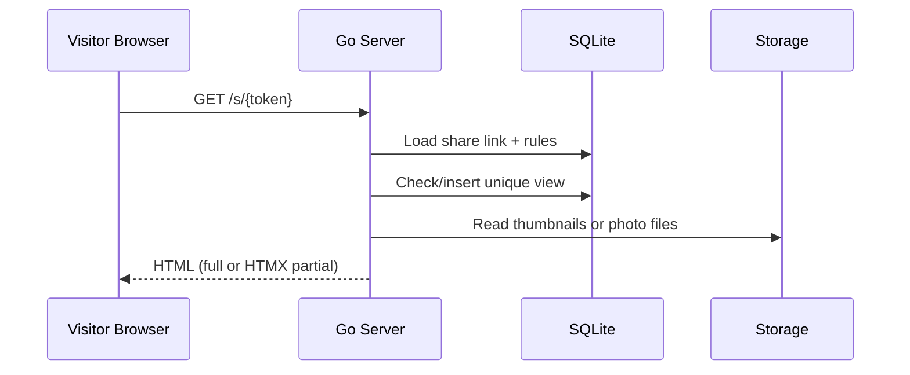
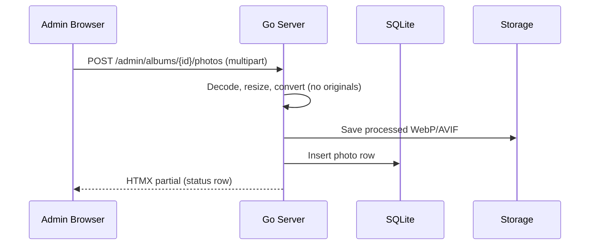

# FamilyShare — Technical Design Document (TDD)

## Overview
FamilyShare is a lightweight, self-hosted photo and album sharing web application built in Go for low-resource VPS environments. The system prioritizes efficient storage, fast page loads on mobile devices, and secure token-based sharing without visitor accounts.

### Goals
- Simple, reliable photo sharing with “magic links” for albums and photos.
- Minimal CPU, memory, and disk usage.
- Storage optimization through immediate image processing and conversion.
- SSR-first UX with HTMX and Alpine.js for light, app-like interactivity.

### Non-Goals
- No public user signups or visitor logins.
- No heavy JS frameworks (React/Vue/Node.js tooling).
- No external DB services; SQLite only.

### Key Constraints
- **No CGO**: use a pure-Go SQLite driver (e.g., `modernc.org/sqlite`).
- **No originals saved**: only processed images on disk.

## Architecture & Data Flow

### High-Level Architecture
- **Go HTTP Server** with `net/http` or `chi` for routing.
- **SSR templates** using `html/template` and embedded assets via `fs.FS`.
- **SQLite** for metadata and access rules (via sqlc).
- **Static file storage** for processed images only.

### Request Flow (HTMX-aware)
1. **Browser** requests a page or HTMX partial.
2. **Router** dispatches to a handler.
3. **Handler** loads data via SQLite queries (sqlc).
4. **Template renderer** returns full page or partial HTML.
5. **HTMX** swaps partial content in-place and triggers Alpine.js state updates when needed.

### Image Delivery & Format Negotiation
- On each image request, inspect the `Accept` header.
- If `image/avif` is accepted and an AVIF variant exists, serve AVIF.
- Otherwise serve WebP (default fallback).
- If neither is accepted, optionally fall back to WebP with a standard `Content-Type` and rely on modern client support.

### Component Diagram (Text)
Client (Browser + HTMX/Alpine) ➜ Go Router ➜ Handler ➜ SQLite + Storage ➜ Template Renderer ➜ Response HTML

### Sequence Diagrams (Mermaid)

#### Public Share Link View

#### Admin Upload Flow

### Image Processing Pipeline (Critical)
**Strategy:** process uploads immediately; never store originals.

Pipeline stages:
1. **Upload stream** accepted with size limits (memory cap + optional temp file fallback).
2. **Content sniffing** to confirm allowed image types.
3. **Decode** into image format; honor EXIF orientation when decoding.
4. **Resize** to max 1920px (width or height) preserving aspect ratio.
5. **Convert** to WebP at quality 80 and optionally to AVIF for capable clients.
6. **Save** processed image to disk, write metadata to SQLite.
7. **Cleanup** temporary buffers/files regardless of success/failure.

Failure handling: on any stage failure, no output file remains and DB is not updated.

### Storage Layout
- Base directory: `./data` (configurable)
- Processed files only, e.g. `data/photos/{yyyy}/{mm}/{album_id}/{photo_id}.webp`
- Optional AVIF variant stored alongside: `data/photos/{yyyy}/{mm}/{album_id}/{photo_id}.avif`
- Thumbnails (optional): `data/thumbs/{yyyy}/{mm}/{album_id}/{photo_id}.webp`

## Database Schema (SQLite)

### Entity Relationships
- **Albums** contain many **Photos**.
- **ShareLinks** can point to an Album or a Photo.
- **ShareLinkViews** track unique viewers to protect view limits.

### Tables

#### albums
- `id` (INTEGER, PK)
- `title` (TEXT)
- `description` (TEXT, nullable)
- `cover_photo_id` (INTEGER, nullable)
- `created_at` (DATETIME)
- `updated_at` (DATETIME)

#### photos
- `id` (INTEGER, PK)
- `album_id` (INTEGER, FK -> albums.id)
- `filename` (TEXT) — stored processed filename only
- `width` (INTEGER)
- `height` (INTEGER)
- `size_bytes` (INTEGER)
- `format` (TEXT) — `webp` or `avif`
- `created_at` (DATETIME)

#### activity_events
- `id` (INTEGER, PK)
- `event_type` (TEXT) — `photo_view`, `album_view`, `share_view`, `upload`
- `album_id` (INTEGER, nullable)
- `photo_id` (INTEGER, nullable)
- `share_link_id` (INTEGER, nullable)
- `created_at` (DATETIME)

#### share_links
- `id` (INTEGER, PK)
- `token` (TEXT, UNIQUE)
- `target_type` (TEXT) — `album` or `photo`
- `target_id` (INTEGER)
- `max_views` (INTEGER, nullable)
- `expires_at` (DATETIME, nullable)
- `created_at` (DATETIME)
- `revoked_at` (DATETIME, nullable)

#### share_link_views
- `id` (INTEGER, PK)
- `share_link_id` (INTEGER, FK -> share_links.id)
- `viewer_hash` (TEXT) — stable identifier for a viewer/session
- `created_at` (DATETIME)

### View Count Logic (Unique Visitors)
- On visit, compute `viewer_hash` from a signed, short-lived cookie scoped to the token.
- If no prior `share_link_views` record exists for this link+viewer, insert and increment effective view count.
- If a record exists, do not increment views; allow access.
- Enforce `max_views` by counting **unique** `share_link_views` entries.

### Indexes
- `share_links(token)` unique index
- `photos(album_id)`
- `share_link_views(share_link_id, viewer_hash)` unique index for dedupe
- `activity_events(created_at)`

### Migration Strategy
- Simple SQL migration files (e.g., `internal/db/migrations/0001_init.sql`).
- Apply on startup with a migration guard table.

## API & Routing

### Public Routes
- `GET /` → homepage (recent albums)
- `GET /a/{album_id}` → public album page (if published)
- `GET /p/{photo_id}` → public photo page
- `GET /s/{token}` → share link landing
- `GET /s/{token}/photos?page=` → HTMX partial for pagination

### Admin Routes (Protected)
- `GET /admin/login`
- `POST /admin/login`
- `POST /admin/logout`
- `GET /admin/albums`
- `POST /admin/albums` → create
- `POST /admin/albums/{id}` → update
- `DELETE /admin/albums/{id}` → delete
- `POST /admin/albums/{id}/photos` → upload
- `DELETE /admin/photos/{id}`
- `POST /admin/shares` → create share link
- `DELETE /admin/shares/{id}` → revoke share link

### HTMX Response Conventions
- Full HTML layout for normal requests; partials for `HX-Request: true`.
- 204 for no-op (e.g., deletion already done).
- Return fragment with `hx-swap-oob` for progress/status updates.

## sqlc Query Catalog (Sketch)
- `CreateAlbum(title, description)`
- `ListAlbums(limit, offset)`
- `GetAlbum(id)`
- `UpdateAlbum(id, title, description, cover_photo_id)`
- `DeleteAlbum(id)`
- `CreatePhoto(album_id, filename, width, height, size_bytes, format)`
- `ListAlbumPhotos(album_id, limit, offset)`
- `DeletePhoto(id)`
- `CreateShareLink(token, target_type, target_id, max_views, expires_at)`
- `GetShareLinkByToken(token)`
- `RevokeShareLink(id)`
- `InsertShareLinkView(share_link_id, viewer_hash)`
- `CountUniqueShareLinkViews(share_link_id)`
- `DeleteExpiredShareLinks(now)`
- `DeleteOrphanPhotos()`
- `InsertActivityEvent(event_type, album_id, photo_id, share_link_id)`
- `ListActivityEventsSince(start_time)`
- `CountActivityByTypeSince(start_time)`

## UX/UI Specifications (HTMX + Alpine.js)

### Visitor Experience
- **Album pages** render initial grid using SSR.
- **Infinite scroll / click-to-load**: HTMX fetches next page of photos with `hx-get` and swaps into a grid container.
- **Lightbox & carousel**: Alpine.js manages modal overlay, image index, focus trap, and keyboard navigation.
- **Performance**: serve responsive sizes with `srcset` where possible; lazy-load images.
- **Accessibility**: ARIA labels, focus restoration on modal close, keyboard controls.

### Admin Experience
- **Login**: simple form-based session login with password.
- **Album management**: create, rename, delete, set cover photo.
- **Drag-and-drop upload**: HTMX form with `hx-trigger="change"` or `drop` events; progress indicator shown via HTMX response fragments.
- **Batch uploads**: show per-file status row, failed items with retry.
- **Optimistic UI**: insert placeholders while processing, replaced when saved.
- **Activity metrics**: lightweight dashboard cards (last 7/30 days) for uploads, album views, photo views, and share link hits.

### Error & Empty States
- **Link expired**: dedicated page explaining expiration and contact instructions.
- **View limit reached**: message showing limit exceeded, optionally show request access button.
- **No photos**: empty state for new albums with a friendly CTA for admin.
- **Upload failures**: inline error row with retry action.

## Security Implementation

### Token Generation
- Use `crypto/rand` to generate high-entropy tokens.
- Store tokens as URL-safe base64 or hex.
- Tokens are **never guessable**; rate-limited in middleware.

### Admin Session Management
- Server-side session store (SQLite) with signed cookie.
- Session expiration enforced (e.g., 24h idle / 7d absolute).
- `SameSite=Lax` cookies, `HttpOnly`, `Secure` when HTTPS enabled.

### Password Storage
- Store a bcrypt (or argon2id) hash; never store plaintext.
- Optional pepper from environment for extra protection.

### CSRF Protection
- Use CSRF tokens for all state-changing admin requests.
- HTMX requests include CSRF via header or hidden input.

### Brute-Force Mitigation
- Token-bucket rate limiter for `/s/{token}`.
- Backoff on repeated 404/invalid token hits.
- Optional temporary lockout when excessive failures detected.

### Headers & Hardening
- `Content-Security-Policy` to restrict scripts to self + HTMX/Alpine CDNs.
- `X-Content-Type-Options: nosniff`, `X-Frame-Options: DENY`.

## Maintenance Strategy

### Background Janitor (Goroutine)
- Runs periodically (e.g., every 1–6 hours).
- Responsibilities:
  - Delete **expired or revoked** share links.
  - Delete orphaned photos (no album, or album deleted).
  - Remove photo files from disk when their DB rows are removed.
  - Compact/cleanup old view logs beyond retention window.

### Data Retention
- Keep `share_link_views` for 30–90 days to enforce view limits and audit.
- Purge expired links and associated logs to minimize DB growth.
- Optional monthly `VACUUM` for SQLite to reclaim space.

## Operational Notes
- **Low-resource VPS**: prioritize streaming uploads, bounded memory usage, and fast image processing.
- **Backups**: nightly SQLite backup + image storage tarball.
- **Observability**: structured logs with request ID, upload duration, image size.
- **Caching**: set `Cache-Control` for images; use ETag or last-modified.

## Deployment
- Run as a systemd service behind Caddy/Nginx for TLS.
- Configure storage path and secrets via environment.
- Enable HTTPS to secure admin sessions and share links.

## Testing Strategy
- Unit tests for token generation, view counting, and permissions.
- Integration tests with temporary SQLite DB and local file storage.
- Image pipeline tests with small fixtures to validate resizing and encoding.

## Future Enhancements (Optional)
- Per-album password as an additional optional security layer.
- Basic email notifications on new uploads or share link usage.
- Smarter on-demand thumbnail generation for ultra-low disk usage.
